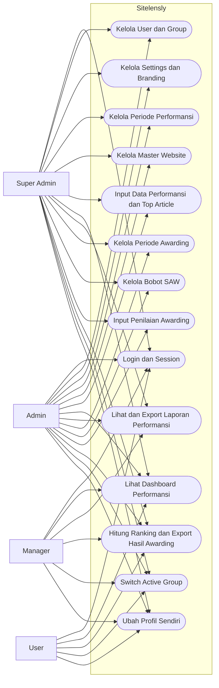
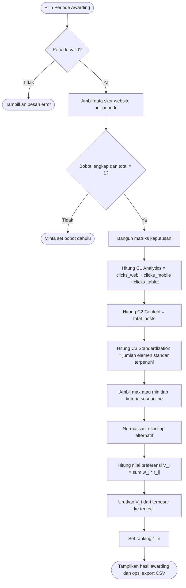

# Software Requirements Specification (SRS)

## Sitelensly

Sistem Monitoring Performansi Website dan Awarding berbasis SAW

Versi dokumen: 2.0  
Tanggal: 29-06-2026

## Riwayat Revisi

| Nama | Tanggal | Perubahan | Versi |
| --- | --- | --- | --- |
| Tim Pengembang | 30-11-2025 | Dokumen awal (belum sesuai aplikasi ini) | 1.0 |
| Tim Pengembang | 29-06-2026 | Penyesuaian total sesuai source code Sitelensly | 2.0 |

## 1. Pendahuluan

### 1.1 Tujuan

Dokumen ini mendefinisikan kebutuhan fungsional dan non-fungsional aplikasi Sitelensly berdasarkan implementasi yang tersedia pada source code saat ini.

### 1.2 Ruang Lingkup

Sitelensly adalah aplikasi web untuk:

1. Mengelola master website unit/prodi/fakultas.
2. Mengelola periode pelaporan performansi website.
3. Mencatat data performansi website per periode (klik per perangkat, jumlah postingan, artikel teratas).
4. Menyajikan dashboard performansi dan laporan ringkas.
5. Menjalankan proses awarding website dengan metode SAW (Simple Additive Weighting).
6. Mengelola pengguna, role/group, permission, profil, dan pengaturan sistem.

### 1.3 Definisi Singkat

- SAW: Metode Multi-Criteria Decision Making dengan normalisasi dan pembobotan.
- RBAC: Role-Based Access Control berbasis group dan permission.
- Periode Performansi: Periode input data performansi website (status open/closed).
- Periode Awarding: Periode khusus penilaian awarding (status draft/active/completed).

### 1.4 Referensi

1. IEEE Std 830-1998 (format SRS).
2. Source code aplikasi pada folder app/Controllers, app/Models, app/Config/Routes.php, dan app/Database/Migrations.

## 2. Deskripsi Umum Sistem

### 2.1 Perspektif Produk

Sitelensly dibangun dengan CodeIgniter 4 + Shield Auth untuk autentikasi dan otorisasi. Aplikasi menyediakan area pengguna login dan area admin berbasis permission. Data tersimpan pada database relasional dengan tabel master, transaksi performansi, dan transaksi awarding.

### 2.2 Karakteristik Pengguna

1. Super Admin: Kontrol penuh seluruh fitur.
2. Admin: Mengelola data operasional harian.
3. Manager: Melihat dashboard, laporan, dan hasil awarding.
4. User: Akses terbatas pada dashboard performansi dan hasil awarding.

### 2.3 Lingkungan Operasi

1. Platform: Web browser modern.
2. Backend: PHP 8.2+.
3. Framework: CodeIgniter 4.
4. Auth/RBAC: CodeIgniter Shield + custom filter role/permission.

### 2.4 Batasan

1. Semua fitur utama memerlukan login (session auth).
2. Akses fitur dibatasi permission/group pada level route.
3. Input data performansi hanya pada periode berstatus open.
4. Input/edit/hapus skor awarding hanya saat periode awarding berstatus active.

## 3. Kebutuhan Fungsional

### F-01 Autentikasi dan Sesi

1. Sistem mengarahkan root URL ke halaman login jika belum login, atau ke dashboard jika sudah login.
2. Sistem menggunakan session auth untuk melindungi route privat.
3. Sistem menyediakan pergantian active group bagi user multi-group.

### F-02 Manajemen Pengguna dan Role

1. Admin dapat melihat daftar user.
2. Admin dapat menambah, mengubah, dan menghapus user.
3. Admin dapat menetapkan satu atau lebih group untuk user.
4. Sistem mencegah user menghapus akun dirinya sendiri.
5. Superadmin dapat melihat halaman informasi role dan permission.

### F-03 Profil Pengguna

1. User dapat melihat profil sendiri.
2. User dapat memperbarui username.
3. User dapat mengganti password (opsional, jika diisi).

### F-04 Pengaturan Sistem

1. Admin dapat mengubah pengaturan umum (nama situs, deskripsi, footer, versi).
2. Admin dapat mengubah pengaturan autentikasi (default role, allow registration).
3. Admin dapat mengaktifkan/nonaktifkan maintenance mode dan pesan maintenance.
4. Admin dapat mengubah pengaturan mail (protocol, host, port, username, password, encryption, from).
5. Admin dapat upload/hapus branding favicon dan logo sesuai validasi tipe/ukuran file.

### F-05 Maintenance Mode

1. Jika maintenance mode aktif, user non-superadmin diarahkan ke halaman maintenance.
2. Superadmin tetap dapat mengakses sistem saat maintenance aktif.
3. Route login/logout/register tetap dapat diakses saat maintenance aktif.

### F-06 Manajemen Periode Performansi

1. Admin dapat CRUD periode performansi.
2. Setiap periode memiliki status open/closed.
3. Admin dapat toggle status open/closed.

### F-07 Master Website

1. Admin dapat CRUD master website.
2. Data website mencakup: nama website, kategori, URL, deskripsi, admin_name, admin_contact, status.
3. Kategori website: prodi, fakultas, unit, lembaga, pusat, lainnya.
4. Status website: active/inactive.

### F-08 Input Data Performansi Website

1. Admin dapat melihat daftar data performansi per periode.
2. Admin dapat menambah data performansi: klik web, klik mobile, klik tablet, total postingan baru, last post date.
3. Admin dapat menambah daftar top article (judul dan klik), disimpan per ranking.
4. Sistem menolak input jika periode tidak open.
5. Sistem menolak duplikasi data untuk kombinasi website + periode.
6. Admin dapat mengubah dan menghapus data performansi.

### F-09 Dashboard Performansi

1. Sistem menampilkan ringkasan klik dan postingan berdasarkan filter periode dan website.
2. Sistem menampilkan tren multi-periode.
3. Sistem menampilkan grafik postingan per website.
4. Sistem menampilkan leaderboard artikel teratas.
5. Sistem menampilkan timeline last update website.

### F-10 Laporan Ringkas Performansi

1. Sistem menampilkan laporan ringkas performansi per periode.
2. Data diurutkan berdasarkan total klik tertinggi.
3. Sistem menyediakan ekspor CSV laporan performansi.
4. CSV memuat data website, klik per perangkat, total klik, total postingan, tanggal update terakhir, dan Top 1-Top 3 artikel.

### F-11 Manajemen Periode Awarding

1. Admin dapat CRUD periode awarding.
2. Periode awarding dapat dikaitkan dengan periode performansi (opsional).
3. Status periode awarding: draft, active, completed.
4. Untuk aktivasi periode awarding, sistem wajib memastikan:
   - Bobot kriteria lengkap dan total bobot = 1.
   - Tidak ada periode awarding lain yang sedang active.
5. Periode awarding berstatus active tidak dapat dihapus.

### F-12 Bobot Penilaian Awarding

1. Admin dapat mengelola bobot kriteria SAW per periode awarding.
2. Kriteria default:
   - analytics (benefit)
   - content (benefit)
   - web_standardization (benefit)
3. Sistem memvalidasi:
   - Setiap bobot > 0.
   - Total bobot seluruh kriteria = 1.00.
4. Periode awarding berstatus completed tidak dapat diubah bobotnya.

### F-13 Input Penilaian Awarding

1. Admin dapat melihat daftar penilaian awarding per periode.
2. Admin dapat menambah penilaian untuk website yang belum dinilai pada periode tersebut.
3. Komponen nilai:
   - Analytics: clicks_web, clicks_mobile, clicks_tablet.
   - Content: total_posts.
   - Standarisasi: 17 elemen checklist.
4. Sistem dapat mengambil (import) data analytics/content dari modul performansi melalui endpoint AJAX.
5. Sistem menolak duplikasi penilaian untuk kombinasi awarding_period + website.
6. Edit/hapus penilaian hanya diizinkan saat periode awarding active.

### F-14 Hasil dan Peringkat Awarding (SAW)

1. Sistem menghitung nilai preferensi SAW untuk seluruh alternatif website dalam periode awarding terpilih.
2. Formula yang digunakan:
   - Normalisasi benefit: r_ij = x_ij / max(x_j)
   - Normalisasi cost: r_ij = min(x_j) / x_ij
   - Nilai preferensi: V_i = sum(w_j * r_ij)
3. Sistem mengurutkan hasil berdasarkan V_i tertinggi dan menghasilkan ranking.
4. Sistem menyediakan ekspor CSV hasil awarding berisi raw score, normalisasi, bobot, dan nilai preferensi.

## 4. Kebutuhan Data

### 4.1 Entitas Utama

1. ms_periods (periode performansi)
2. ms_websites (master website)
3. tr_performance (data performansi per website-periode)
4. tr_top_articles (artikel top terkait data performansi)
5. ms_awarding_periods (periode awarding)
6. ms_awarding_weights (bobot kriteria per periode awarding)
7. tr_awarding_scores (nilai awarding per website-periode awarding)

### 4.2 Constraint Penting

1. Kombinasi unik website_id + period_id pada tr_performance.
2. Kombinasi unik awarding_period_id + criteria_code pada ms_awarding_weights.
3. Kombinasi unik awarding_period_id + website_id pada tr_awarding_scores.
4. Relasi foreign key dengan aksi cascade pada data turunan yang relevan.

## 5. Kebutuhan Non-Fungsional

### NF-01 Keamanan

1. Sistem menerapkan autentikasi berbasis session.
2. Sistem menerapkan otorisasi berbasis role/group dan permission.
3. Validasi input diterapkan pada form CRUD dan endpoint penting.

### NF-02 Ketersediaan Operasional

1. Sistem mendukung mode maintenance global.
2. Saat maintenance aktif, akses dibatasi kecuali superadmin.

### NF-03 Integritas Data

1. Sistem menjaga konsistensi data melalui foreign key dan unique key.
2. Operasi input/edit tertentu dibatasi oleh status periode.

### NF-04 Kompatibilitas dan Platform

1. Sistem berjalan pada PHP 8.2 atau lebih baru.
2. Sistem menggunakan DB yang mendukung constraint relasional.

### NF-05 Ekspor Data

1. Sistem menyediakan ekspor CSV untuk laporan performansi dan hasil awarding.
2. File ekspor dapat dibuka pada aplikasi spreadsheet umum.

## 6. Hak Akses Ringkas (RBAC)

1. superadmin: akses penuh modul admin, user, role, settings, performansi, laporan, awarding.
2. admin: akses operasional admin dengan cakupan luas sesuai permission yang diberikan.
3. manager: akses monitoring, laporan, hasil awarding, dan view data tertentu.
4. user: akses terbatas pada dashboard performansi dan hasil awarding.

## 7. Ruang Lingkup yang Tidak Diimplementasikan

Berdasarkan source code saat ini, fitur berikut tidak ditemukan:

1. Integrasi WhatsApp device/pairing/chat/ticketing.
2. Modul quick response template.
3. Alur helpdesk ticket lifecycle.

Dokumen SRS ini menggantikan requirement lama yang masih mengacu ke domain helpdesk WhatsApp.

## 8. Lampiran Diagram

### 8.1 Use Case Diagram (Mermaid)

### 8.2 Alur Perhitungan SAW (Mermaid)

